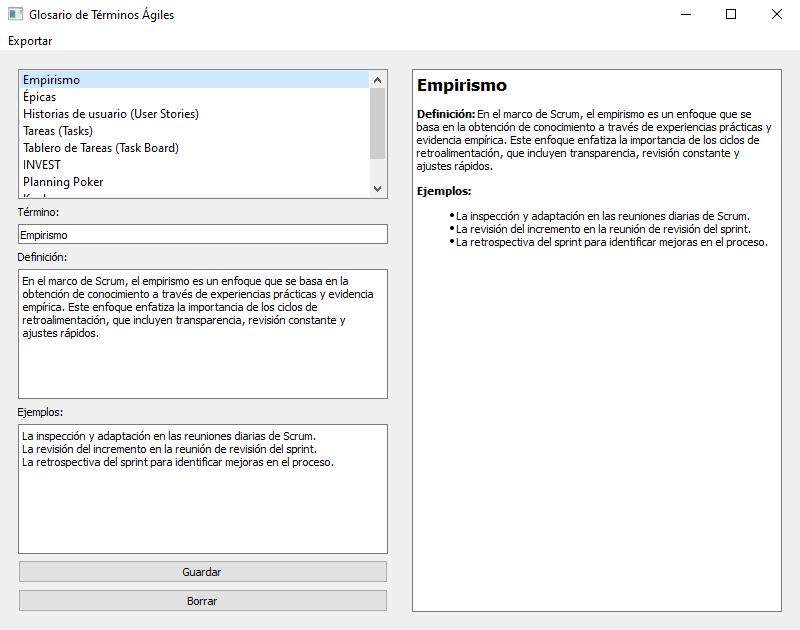
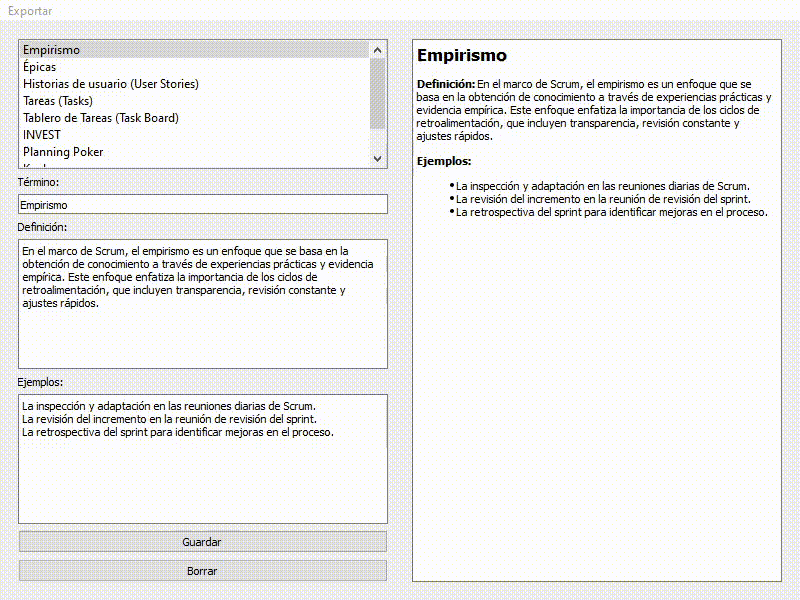

# Glosario de Términos Ágiles

Esta aplicación es un glosario interactivo para gestionar y visualizar términos relacionados con la metodología ágil. Está desarrollada utilizando PyQt5 para la interfaz gráfica de usuario y permite a los usuarios ver, agregar, editar, eliminar y exportar términos desde un archivo XML.

## Características

- **Visualización de términos**: Muestra los términos disponibles en una lista y permite seleccionar un término para visualizar su definición y ejemplos.
- **Gestión de términos**: Los usuarios pueden agregar nuevos términos, editar los existentes o eliminarlos.
- **Exportación**: Los términos se pueden exportar a varios formatos (LaTeX, Markdown, HTML, y Word).
- **Navegación**: Los usuarios pueden navegar por los términos usando botones de navegación.
- **Ordenación**: Los términos se pueden ordenar alfabéticamente, ya sea de forma ascendente o descendente.

## Cómo usar

1. **Cargar la aplicación**: Al iniciar la aplicación, los términos se cargan desde un archivo XML predefinido (`input/glosario_agil.xml`).
2. **Ver un término**: Selecciona un término de la lista en el panel izquierdo para ver su definición y ejemplos en el panel derecho.
3. **Agregar un nuevo término**: Haz clic en el botón "Nuevo" para limpiar los campos y comenzar a ingresar un nuevo término. Luego, completa los campos y presiona "Guardar" para agregar el término.
4. **Editar un término**: Selecciona un término de la lista y realiza los cambios necesarios en los campos de texto. Después, haz clic en "Guardar" para aplicar los cambios.
5. **Eliminar un término**: Selecciona un término de la lista y haz clic en "Borrar". Confirma la acción en el mensaje emergente.
6. **Exportar términos**: Utiliza el menú "Exportar" en la parte superior de la aplicación para exportar los términos a diferentes formatos (LaTeX, Markdown, HTML, Word).
7. **Navegación y ordenación**: Usa los botones de navegación (flechas izquierda/derecha) para moverte entre términos y los botones de ordenación (A-Z, Z-A) para ordenar los términos.

## Requisitos

- Python 3.x
- PyQt5
- Los módulos adicionales `glosario_manager` y `ExportManager` deben estar en el mismo directorio que este script.

## Cómo ejecutar la aplicación

1. Asegúrate de tener Python 3.x instalado.
2. Instala las dependencias necesarias con el siguiente comando:

    ```shell
    pip install PyQt5
    ```

3. Coloca este script y los módulos adicionales (`glosario_manager.py` y `ExportManager.py`) en la misma carpeta.
4. Ejecuta la aplicación con el siguiente comando:

    ```shell
    python nombre_del_script.py
    ```

## Notas

- Los términos se almacenan y cargan desde un archivo XML (`input/glosario_agil.xml`).
- Cuando se guarda o elimina un término, el archivo XML se actualiza automáticamente.

¡Disfruta usando esta aplicación para gestionar tus términos de metodología ágil!

## Imágenes

